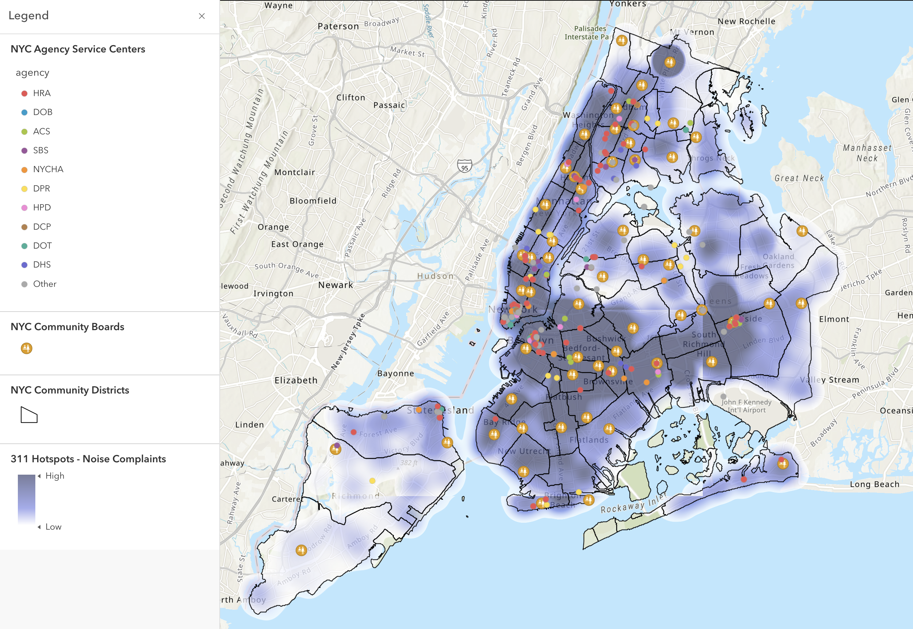

# NYC 311 Reporting

Some of the most important but largely invisible systems in cities are what we call "soft systems", the social, cultural and economic networks that shape the physical and human side of cities. This repo tracks EDA and explorations around a particularly salient system for residents of NYC: the 311 reporting service. The goal is to identify and map the components that make up the system, including its network structure, agents, nodes and flows.

N.B. ArcGIS Map: https://arcg.is/8ifnL

### Identification, Visualization and Analysis of a Soft System

311 is a 'hotline' that users can dial to submit service requests for government agencies to address. These agencies can then take this data and create work orders for teams to fix the problems raised. This system exists primarily in urban settings and covers non-emergency complaints such as noise, downed trees, and illegally parked cars. One can think of it as a ticketing system that the NYC government uses to receive, track, and prioritize urban issues. 311 reporting is thus a soft system that helps orchestrate the healthy function of NYC municipal services.

It's important to differentiate 311 reporting from the hard systems that it's inherently intertwined with. In the soft systems view, the 311 reporting network is much more fluid and not to be conflated with:

1. the physical communications network infrastructure (mobile, internet networks) that the system leverages in order to operate
2. the service requests that relate to networks of hard physical infrastructure: transportation, water & sanitation, buildings etc.

There are 'hard' elements then in 311 operations. But we shall define the overall network as characterized by a set of human processes and interactions that make it decidedly 'soft'.

The nodes of this network are the City agencies and 59 local community boards across the city. It would also be fair to suggest the nodes be the call centers that handle 311 service requests, but that would conflating the system with network #1 above. In addition, these call centers are not the political decision-making units that determine which work orders should be carried out to address concerns. Instead, it is the main responsibility of the community board office to assess the needs of their neighborhoods, receive complaints from residents, and meet with City agencies to make recommendations on actionable items. To this end, Local Law 47 of 2005 requires the Department of Information Technology and Telecommunications (DoITT) to issue monthly reports to community boards and the public.

The agents in this network are the operators that correspond to the nodes described above. Ultimately, the boards serve as advocates but tasks are performed by agency officials and employees. The community boards themselves each consist of up to 50 non-salaried members appointed by the Borough President. And by far the most prevalent agents in this data will be the 311 reporters themselves. The 311 data links agents in these communities through a shared involvement and interest in the wellbeing of the neighborhood. These agents can be any member of the community that resides, works, or has some other significant interest in the area.

The process flow of this network has been hinted above. Over time, service requests flow from neighborhood residents to community boards (through the aforementioned Local Law 47 of 2005), before they're advocated for to city agencies. In turn, there is a flow back into the community of responses and fixes to issues raised.

This analysis only has visibility into the first phase of this flow, and leverages 3 sets of data from NYC Open Data sources:

1. [311 Service Requests from 2010 to Present](https://data.cityofnewyork.us/Social-Services/311-Service-Requests-from-2010-to-Present/erm2-nwe9): provides 311 reporting as far back as 2010, and is updated on an automated daily basis. Each record in this dataset corresponds to a 311 service request.
2. [NYC Community Boards](https://data.cityofnewyork.us/City-Government/NYC-Community-Boards/ruf7-3wgc) + [Community Districts](https://data.cityofnewyork.us/City-Government/Community-Districts/yfnk-k7r4): (for the ArcGIS map) provides the locations of community boards described as nodes above, as well as neighborhood boundaries.
3. [Agency Service Center](https://data.cityofnewyork.us/Social-Services/Agency-Service-Center/nn5y-wmuj): (for the ArcGIS map) provides locations of agency service centers described as nodes above.
4. [311 Service Level Agreements](https://data.cityofnewyork.us/City-Government/311-Service-Level-Agreements/cs9t-e3x8): Provides the time commitments that City Agencies have made to respond to 311 Service Requests that are assigned to them.

**Major takeaways include:**
- Periodicity: several agencies face 311 calls in seasonal waves. For example, housing preservation and development (HPD) faces most calls in winter months when heat/hot water are front of mind. The NYPD faces most calls in summer months, when most residents are out and about. There are also so peak events corresponding to the ending of COVID-19 lockdowns.
- TTR varies by geography: Deeper parts of Brooklyn and Staten Island are more poorly serviced when measured by time to resolution. This can stand in contrast to where the most 311 submissions are actually filed.
- SLA breaches: Most agencies outside of the Department for Consumer Affairs and the NYPD are struggling to meet SLA agreements.
